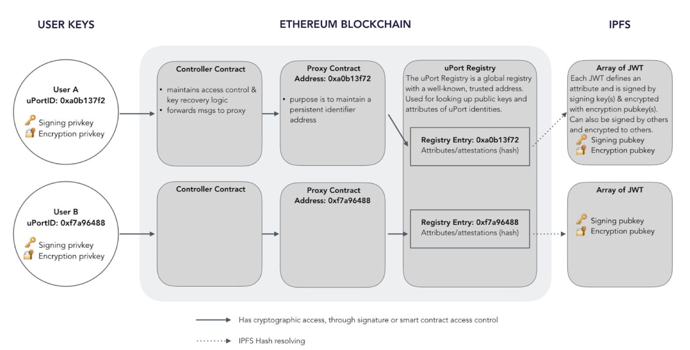

# Express uPort as javascript

I express uPort contracts and IPFS as javascript for deeper understanding how it work. Honestly, I don't confident whether my understanding is correct even though I took care to be accurate as long as possible referring to white paper and Github and official documents. Please check documents for accurate info.

## Get started

### Run install command
`npm install`

### Execute flow
`node main.js` 
If I puck pack all process into main.js, it will hard to read. So I will divide into several branches. Please checkout.

## Set IPFS hash to Registry
Please checkout 'set-ipfs-hash-to-registry' branch and refer to following blog post for further information. 

Blog Post: [Simplified code of Bitcoin Lightning Network — Spend Revocable Delivery](https://medium.com/@t.tak/simplified-code-of-bitcoin-lightning-network-spend-revocable-delivery-90e50f0256d5)
 

